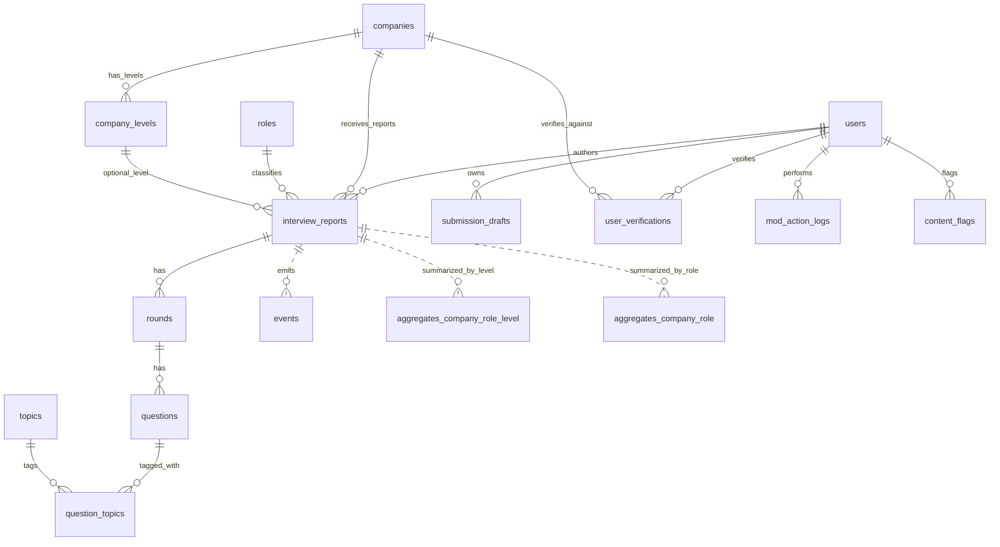

# Data Model

This is the single human-readable map of the data model. The executable source
of truth stays in code:

- Postgres tables and enums: [`packages/db/src/schema/index.ts`](../packages/db/src/schema/index.ts).
  Drizzle Kit reads this barrel, so a table or enum is not part of the schema
  unless it is exported there.
- Applied DDL: [`packages/db/src/migrations/`](../packages/db/src/migrations/).
- Hand-written aggregate DDL: [`packages/db/views/`](../packages/db/views/),
  copied into matching migrations and checked by tests.
- Cross-package form contracts: [`packages/shared/src/submission.ts`](../packages/shared/src/submission.ts).
- Search index contracts: [`packages/search/src/schemas/`](../packages/search/src/schemas/).

Keep detailed model docs here and link here from READMEs, ADRs, sprint notes, or
product plans. Do not create another full schema summary elsewhere.

## Change Rules

1. Change the Drizzle schema module or aggregate SQL first.
2. Export new schema modules from `packages/db/src/schema/index.ts`.
3. Generate or update the migration.
4. Update this document when an entity, field, relationship, invariant, derived
   model, or external index shape changes.
5. If an enum is mirrored in `@fromtheloop/shared` or Typesense, update that
   mirror in the same change.

## Entity Graph

`events` and aggregate tables intentionally do not use normal FK constraints:
events are an append-only outbox, and aggregate tables are derived summaries.

## Enums

Source: [`packages/db/src/schema/enums.ts`](../packages/db/src/schema/enums.ts).

| Enum | Values | Used by |
|---|---|---|
| `report_source` | `seed_dummy`, `seed_curated`, `user_submitted`, `imported` | `interview_reports.source` |
| `report_status` | `active`, `pending_moderation`, `deleted` | `interview_reports.status` |
| `report_outcome` | `offer`, `reject`, `withdrew`, `ghosted`, `pending` | `interview_reports.outcome`, shared submission schemas |
| `display_attribution` | `display_name`, `anonymous` | `interview_reports.display_attribution`, shared submission schemas |
| `taxonomy_status` | `active`, `pending`, `merged`, `rejected` | companies, roles, topics, company levels |
| `taxonomy_source` | `seed_curated`, `user_suggested` | companies, roles, topics, company levels |
| `level_tier` | `junior`, `mid`, `senior`, `staff`, `senior_staff`, `principal` | `company_levels.tier` |
| `topic_category` | `algorithms`, `system-design`, `fundamentals`, `machine-learning`, `data-engineering`, `infrastructure`, `behavioral` | `topics.category` |
| `round_type` | `recruiter-screen`, `technical-phone`, `onsite-coding`, `onsite-system-design`, `onsite-behavioral`, `take-home`, `hiring-manager`, `exec-final`, `other` | `rounds.round_type`, shared submission schemas |
| `round_rating` | `positive`, `mixed`, `negative` | `rounds.rating`, shared submission schemas |
| `verification_method` | `work_email`, `linkedin`, `manual` | `user_verifications.verified_via` |
| `mod_action_type` | `approve`, `reject`, `merge`, `ban`, `delete`, `hide`, `edit_taxonomy`, `restore`, `view_as` | `mod_action_logs.action_type` |
| `content_flag_target` | `report`, `comment` | `content_flags.target_type` |
| `content_flag_reason` | `spam`, `harassment`, `pii`, `misinformation`, `off_topic`, `other` | `content_flags.reason` |
| `content_flag_status` | `open`, `actioned`, `dismissed` | `content_flags.status` |
| `blocklist_category` | `slur`, `pii`, `spam`, `other` | `regex_blocklist.category` |

## Persistent Postgres Models

Column names below are database column names. Drizzle exports camelCase
properties and `$inferSelect` / `$inferInsert` types from each schema module.

### `users`

Source: [`packages/db/src/schema/users.ts`](../packages/db/src/schema/users.ts).

Internal user identity. Clerk owns auth; this row gives application data a stable
UUID to reference.

| Column | Type | Notes |
|---|---|---|
| `id` | `uuid` | Primary key, defaults to `gen_random_uuid()` |
| `clerk_id` | `text` | Unique, nullable until synced/upserted |
| `email` | `text` | Indexed, nullable |
| `username` | `text` | Unique, nullable |
| `display_name` | `text` | Nullable |
| `created_at` | `timestamptz` | Defaults to `now()` |

Relationships: authors `interview_reports` via `created_by_user_id`, owns
`submission_drafts`, owns `user_verifications`, and performs `mod_action_logs`.

### `companies`

Source: [`packages/db/src/schema/taxonomy.ts`](../packages/db/src/schema/taxonomy.ts).

Curated or pending company taxonomy row.

| Column | Type | Notes |
|---|---|---|
| `id` | `uuid` | Primary key |
| `slug` | `text` | Required, unique |
| `name` | `text` | Required |
| `aliases` | `text[]` | Required, defaults to empty array |
| `domain` | `text` | Primary work-email domain, nullable |
| `status` | `taxonomy_status` | Defaults to `active` |
| `source` | `taxonomy_source` | Defaults to `user_suggested` |
| `suggested_by_user_id` | `uuid` | Nullable FK to `users`, `ON DELETE SET NULL` |
| `created_at` | `timestamptz` | Defaults to `now()` |

Relationships: referenced by reports, company levels, and user verifications.
Report and verification FKs restrict deletion.

### `roles`

Source: [`packages/db/src/schema/taxonomy.ts`](../packages/db/src/schema/taxonomy.ts).

Canonical role taxonomy. Roles are a closed set in the submission UI.

| Column | Type | Notes |
|---|---|---|
| `id` | `uuid` | Primary key |
| `slug` | `text` | Required, unique |
| `name` | `text` | Required |
| `aliases` | `text[]` | Required, defaults to empty array |
| `status` | `taxonomy_status` | Defaults to `active` |
| `source` | `taxonomy_source` | Defaults to `user_suggested` |
| `merged_into_id` | `uuid` | Nullable self-FK for merged duplicates |
| `created_at` | `timestamptz` | Defaults to `now()` |

Relationships: referenced by `interview_reports.canonical_role_id`, with
restricted deletion.

### `topics`

Source: [`packages/db/src/schema/taxonomy.ts`](../packages/db/src/schema/taxonomy.ts).

Question-topic taxonomy. A question must have at least one active topic at
finalization, enforced in application validation.

| Column | Type | Notes |
|---|---|---|
| `id` | `uuid` | Primary key |
| `slug` | `text` | Required, unique |
| `name` | `text` | Required |
| `aliases` | `text[]` | Required, defaults to empty array |
| `category` | `topic_category` | Nullable until curated |
| `status` | `taxonomy_status` | Defaults to `active` |
| `source` | `taxonomy_source` | Defaults to `user_suggested` |
| `suggested_by_user_id` | `uuid` | Nullable FK to `users`, `ON DELETE SET NULL` |
| `created_at` | `timestamptz` | Defaults to `now()` |

Relationships: referenced by `question_topics.topic_id`, with restricted
deletion.

### `company_levels`

Source: [`packages/db/src/schema/taxonomy.ts`](../packages/db/src/schema/taxonomy.ts).

Per-company ladder levels, such as Google L4 or Meta E5.

| Column | Type | Notes |
|---|---|---|
| `id` | `uuid` | Primary key |
| `company_id` | `uuid` | Required FK to `companies`, `ON DELETE CASCADE` |
| `slug` | `text` | Required, unique with `company_id` |
| `name` | `text` | Required |
| `order_index` | `integer` | Required, defaults to `0` |
| `tier` | `level_tier` | Nullable canonical seniority mapping |
| `status` | `taxonomy_status` | Defaults to `active` |
| `source` | `taxonomy_source` | Defaults to `user_suggested` |
| `created_at` | `timestamptz` | Defaults to `now()` |

Relationships: optional FK target for `interview_reports.level_id`. Reports also
store `level` as text because the wedge index still keys on that value.

### `submission_drafts`

Source: [`packages/db/src/schema/drafts.ts`](../packages/db/src/schema/drafts.ts).

Server-side autosaved form state.

| Column | Type | Notes |
|---|---|---|
| `id` | `uuid` | Primary key |
| `user_id` | `uuid` | Required FK to `users`, `ON DELETE CASCADE` |
| `data` | `jsonb` | Required, defaults to `{}` |
| `created_at` | `timestamptz` | Defaults to `now()` |
| `updated_at` | `timestamptz` | Defaults to `now()`, bumped on save |

`data` is validated against the tolerant draft schema in
`@fromtheloop/shared` before write.

### `interview_reports`

Source: [`packages/db/src/schema/reports.ts`](../packages/db/src/schema/reports.ts).

Top-level submitted interview experience. One report owns ordered rounds, which
own ordered questions.

| Column | Type | Notes |
|---|---|---|
| `id` | `uuid` | Primary key |
| `source` | `report_source` | Defaults to `user_submitted` |
| `created_by_user_id` | `uuid` | Required FK to `users`, `ON DELETE RESTRICT` |
| `company_id` | `uuid` | Required FK to `companies`, `ON DELETE RESTRICT` |
| `canonical_role_id` | `uuid` | Required FK to `roles`, `ON DELETE RESTRICT` |
| `level` | `text` | Required wedge-axis text |
| `level_id` | `uuid` | Nullable FK to `company_levels`, `ON DELETE RESTRICT` |
| `interview_month` | `text` | Required `YYYY-MM` |
| `outcome` | `report_outcome` | Nullable |
| `display_attribution` | `display_attribution` | Defaults to `anonymous` |
| `evidence_verified` | `boolean` | Defaults to `false` |
| `status` | `report_status` | Defaults to `pending_moderation` |
| `created_at` | `timestamptz` | Defaults to `now()` |
| `locked_at` | `timestamptz` | Defaults to `now() + interval '24 hours'` |
| `deleted_at` | `timestamptz` | Nullable soft-delete stamp |
| `pii_purged_at` | `timestamptz` | Nullable PII purge stamp |

Important indexes:

| Index | Purpose |
|---|---|
| `reports_company_role_level_idx` | Canonical wedge-page lookup: company + role + level |
| `reports_created_by_idx` | User/profile report lookup |
| `reports_status_idx` | Moderation status lookup |

Visibility invariant: public reads and aggregates only include
`status = 'active' AND deleted_at IS NULL`.

Deletion invariant: user deletion is restricted while authored reports exist.
Users retract reports through soft delete; a worker later purges free-text PII.

### `rounds`

Source: [`packages/db/src/schema/rounds.ts`](../packages/db/src/schema/rounds.ts).

Ordered child rows of `interview_reports`.

| Column | Type | Notes |
|---|---|---|
| `id` | `uuid` | Primary key |
| `report_id` | `uuid` | Required FK to `interview_reports`, `ON DELETE CASCADE` |
| `order_index` | `integer` | Required, unique with `report_id` |
| `round_type` | `round_type` | Required |
| `rating` | `round_rating` | Required |
| `experience_prose` | `text` | Nullable |
| `created_at` | `timestamptz` | Defaults to `now()` |

Edit invariant: updating a report replaces all child rounds; questions and topic
joins cascade from the deleted rounds.

### `questions`

Source: [`packages/db/src/schema/questions.ts`](../packages/db/src/schema/questions.ts).

Ordered child rows of `rounds`.

| Column | Type | Notes |
|---|---|---|
| `id` | `uuid` | Primary key |
| `round_id` | `uuid` | Required FK to `rounds`, `ON DELETE CASCADE` |
| `order_index` | `integer` | Required, unique with `round_id` |
| `question_prose` | `text` | Required |
| `created_at` | `timestamptz` | Defaults to `now()` |

There are no standalone question pages in V1; questions render in report detail
or topic-aggregated lists.

### `question_topics`

Source: [`packages/db/src/schema/questions.ts`](../packages/db/src/schema/questions.ts).

Join table from questions to topic taxonomy.

| Column | Type | Notes |
|---|---|---|
| `question_id` | `uuid` | Required FK to `questions`, `ON DELETE CASCADE` |
| `topic_id` | `uuid` | Required FK to `topics`, `ON DELETE RESTRICT` |

Primary key: `(question_id, topic_id)`. A question needing at least one active
topic is an application-level invariant, not a database constraint.

### `user_verifications`

Source: [`packages/db/src/schema/verifications.ts`](../packages/db/src/schema/verifications.ts).

Evidence that a user was verified against a company.

| Column | Type | Notes |
|---|---|---|
| `id` | `uuid` | Primary key |
| `user_id` | `uuid` | Required FK to `users`, `ON DELETE CASCADE` |
| `company_id` | `uuid` | Required FK to `companies`, `ON DELETE RESTRICT` |
| `verified_via` | `verification_method` | Required |
| `evidence_token_hash` | `text` | Required; raw evidence is never stored |
| `verified_at` | `timestamptz` | Defaults to `now()` |

Used to drive trust signals and the denormalized `interview_reports.evidence_verified`.

### `mod_action_logs`

Source: [`packages/db/src/schema/moderation.ts`](../packages/db/src/schema/moderation.ts).

Append-only audit trail for moderation actions.

| Column | Type | Notes |
|---|---|---|
| `id` | `uuid` | Primary key |
| `mod_user_id` | `uuid` | Required FK to `users`, `ON DELETE RESTRICT` |
| `action_type` | `mod_action_type` | Required |
| `target_type` | `text` | Required polymorphic target table/type |
| `target_id` | `uuid` | Required polymorphic target id |
| `reason` | `text` | Nullable |
| `metadata` | `jsonb` | Nullable action-specific context |
| `created_at` | `timestamptz` | Defaults to `now()` |

There is no FK on `target_id` because the target can be a report, user, company,
taxonomy row, or another moderated object.

### `content_flags`

Source: [`packages/db/src/schema/content-flags.ts`](../packages/db/src/schema/content-flags.ts).

Reader abuse-reports against a report or comment (Sprint 6 Day 7, the
community-flags queue). Distinct from `helpful_flags` (a *positive* endorsement
toggle); a content flag is raised once and resolved by a moderator.

| Column | Type | Notes |
|---|---|---|
| `id` | `uuid` | Primary key |
| `target_type` | `content_flag_target` | Required; `report` or `comment` (polymorphic, no FK on `target_id`) |
| `target_id` | `uuid` | Required polymorphic target id |
| `flagger_user_id` | `uuid` | Required FK to `users`, `ON DELETE CASCADE` |
| `reason` | `content_flag_reason` | Required reader-stated category |
| `note` | `text` | Nullable free-text; cleared by the 90-day PII purge |
| `status` | `content_flag_status` | `open` → `actioned` (content removed) \| `dismissed` (unfounded) |
| `resolved_by_user_id` | `uuid` | Nullable FK to `users`, `ON DELETE RESTRICT`; set on resolve |
| `resolved_at` | `timestamptz` | Nullable; set on resolve |
| `created_at` | `timestamptz` | Defaults to `now()` |

Unique on `(target_type, target_id, flagger_user_id)` — one flag per reader per
piece of content. The queue groups open flags by `(target_type, target_id)`; one
moderator decision resolves every open flag on that content. A **hide** removes
the content (comment → `hidden`, report → soft-`deleted` + a `deleted` event) and
writes a `hide` row to `mod_action_logs`; a **dismiss** keeps the content and
writes no audit-log row — the resolution lives on the flag rows themselves.

### `regex_blocklist`

Source: [`packages/db/src/schema/blocklist.ts`](../packages/db/src/schema/blocklist.ts).

Editable slur/PII/spam blocklist (Sprint 6 Day 9). Each row is a case-insensitive
regex tested against proposed company/tag names; a match blocks heuristic
auto-approve (the name is held for a human instead). Admin-only editing surface at
`/admin/blocklist`.

| Column | Type | Notes |
|---|---|---|
| `id` | `uuid` | Primary key |
| `pattern` | `text` | Required regex source; validated to compile (≤ 200 chars) |
| `label` | `text` | Required human description of what it catches |
| `category` | `blocklist_category` | Display grouping; every enabled row is enforced identically |
| `enabled` | `boolean` | Defaults `true`; only enabled rows are matched |
| `created_by_user_id` | `uuid` | Required FK to `users`, `ON DELETE RESTRICT` |
| `created_at` | `timestamptz` | Defaults to `now()` |
| `updated_at` | `timestamptz` | Defaults to `now()`; bumped on toggle |

The row IS its own audit record (`created_by_user_id` + timestamps), so blocklist
edits write no `mod_action_logs` row. The active set is cached in-process for 60s,
so edits hot-reload without a redeploy. Patterns are admin-authored and trusted —
compiled but not sandboxed against catastrophic backtracking.

### `events`

Source: [`packages/db/src/schema/events.ts`](../packages/db/src/schema/events.ts).

Transactional outbox for report writes.

| Column | Type | Notes |
|---|---|---|
| `id` | `uuid` | Primary key |
| `op` | `text` | One of `created`, `updated`, `deleted` |
| `report_id` | `uuid` | Report id, denormalized with no FK |
| `company_id` | `uuid` | Denormalized aggregate cell company |
| `canonical_role_id` | `uuid` | Denormalized aggregate cell role |
| `level` | `text` | Denormalized aggregate cell level |
| `created_at` | `timestamptz` | Defaults to `now()` |
| `aggregate_processed_at` | `timestamptz` | Nullable per-consumer drain marker |
| `search_processed_at` | `timestamptz` | Nullable per-consumer drain marker |

Report writes insert an event in the same transaction. A trigger sends
`pg_notify('events', id)`, and worker pollers use the row as durable fallback.

## Derived Postgres Models

These tables are not declared in `schema/*.ts`. They are hand-written SQL
summary tables maintained by worker jobs and backfill scripts.

### `aggregates_company_role_level`

Source: [`packages/db/views/aggregates_company_role_level.sql`](../packages/db/views/aggregates_company_role_level.sql).
Applied by migration `0008_aggregates_company_role_level.sql`.

One row per live `(company_id, canonical_role_id, level)` wedge cell.

| Column | Type | Notes |
|---|---|---|
| `company_id` | `uuid` | Primary key part |
| `canonical_role_id` | `uuid` | Primary key part |
| `level` | `text` | Primary key part |
| `report_count` | `integer` | Live report volume |
| `outcome_offer` | `integer` | Raw outcome bucket |
| `outcome_reject` | `integer` | Raw outcome bucket |
| `outcome_withdrew` | `integer` | Raw outcome bucket |
| `outcome_ghosted` | `integer` | Raw outcome bucket |
| `outcome_pending` | `integer` | Raw outcome bucket |
| `trust_weighted_count` | `numeric` | Sum of trust weights |
| `median_round_count` | `numeric` | Median number of rounds per report |
| `mode_round_sequence` | `text[]` | Modal ordered round-type sequence |
| `top_topics` | `jsonb` | Up to 10 `{topic_id, slug, name, count, weighted_count}` entries |
| `refreshed_at` | `timestamptz` | Last recompute time |

Refresh functions: `refresh_aggregate_cell(company_id, role_id, level)` and
`refresh_all_aggregates()`.

### `aggregates_company_role`

Source: [`packages/db/views/aggregates_company_role.sql`](../packages/db/views/aggregates_company_role.sql).
Applied by migration `0011_aggregates_company_role.sql`.

One row per live `(company_id, canonical_role_id)` role cell, spanning every
level including the `Unspecified` sentinel.

Fields mirror `aggregates_company_role_level` except there is no `level` column
and the primary key is `(company_id, canonical_role_id)`.

Refresh functions: `refresh_aggregate_role(company_id, role_id)` and
`refresh_all_role_aggregates()`.

### Trust weighting

Source: SQL function `report_trust_weight(boolean)` and JS mirror
[`REPORT_TRUST_WEIGHTS`](../packages/db/src/aggregates.ts).

Current V1 mapping:

| Trust state | Weight |
|---|---:|
| `evidence_verified = true` | `1.0` |
| `evidence_verified = false` | `0.3` |

## Search Index Models

Source: [`packages/search/src/schemas/`](../packages/search/src/schemas/).
Typesense documents are denormalized and rebuilt from Postgres. They are not the
source of truth for user content.

### `reports` collection

Source: [`packages/search/src/schemas/reports.ts`](../packages/search/src/schemas/reports.ts).

One document per active, non-deleted report. Document id equals report UUID.

Fields: `text`, `company_id`, `company_slug`, `company_name`, `role_id`,
`role_slug`, `role_name`, `level`, `outcome`, `round_types`, `round_count`,
`topic_ids`, `topic_slugs`, `topic_names`, `trust_tier`, `evidence_verified`,
`interview_month`, `created_at`.

### `companies` collection

Source: [`packages/search/src/schemas/companies.ts`](../packages/search/src/schemas/companies.ts).

One document per active company. Document id equals company UUID.

Fields: `name`, `slug`, `aliases`, `report_count`.

### `topics` collection

Source: [`packages/search/src/schemas/topics.ts`](../packages/search/src/schemas/topics.ts).

One document per active topic. Document id equals topic UUID.

Fields: `name`, `slug`, `aliases`, `question_count`.

## Shared Application Models

Source: [`packages/shared/src/submission.ts`](../packages/shared/src/submission.ts).

These are cross-package contracts used by the web app, core submission flow, and
DB write layer.

### `SubmissionDraft`

Backs autosave and `submission_drafts.data`. It is intentionally tolerant:
partial forms are valid.

Fields: `company`, `role`, `level`, `outcome`, `month`, `attribution`, `rounds`,
`editingReportId`.

Selection models:

| Model | Shape |
|---|---|
| `CompanySelection` | Existing `{kind, id, name}` or suggested `{kind, name}` |
| `RoleSelection` | Existing `{id, name}` only |
| `LevelSelection` | `{id, name}`, where `id` can be `null` |
| `TopicTagSelection` | Existing `{kind, id, slug, name}` or suggested `{kind, name}` |

### `FinalSubmission`

The server-side finalize gate returns this narrowed shape before a report is
created or updated.

Fields: `company`, `role`, `level`, `outcome`, `month`, `attribution`, `rounds`.

Round and question rules:

- A submission may have zero rounds.
- If a round exists, it must have `roundType` and `rating`.
- A question must have non-blank prose and at least one active topic tag.
- Suggested topic tags are persisted as pending taxonomy rows but do not satisfy
  the active-tag requirement.
- Missing level becomes `Unspecified` with `level_id = null`.
- Missing month becomes the current server month in `YYYY-MM`.

### Write flow

1. The web app stores partial state in `submission_drafts.data`.
2. `validateFinalSubmission` narrows the draft into `FinalSubmission`.
3. Core resolves suggested companies/topics into taxonomy rows.
4. `@fromtheloop/db` writes `interview_reports`, `rounds`, `questions`, and
   `question_topics` in one transaction.
5. The same transaction inserts an `events` row.
6. Workers refresh aggregates and Typesense from the event log.

## Model Invariants

- Public report visibility is `status = 'active' AND deleted_at IS NULL`.
- Report authorship is always stored, even when display attribution is anonymous.
- Reports have a 24-hour edit window controlled by `interview_reports.locked_at`.
- Report deletion is soft delete; the PII purge worker clears free text later.
- Roles are closed in the submission UI; companies and topics can be suggested as
  pending taxonomy rows.
- `Unspecified` levels count in role-grain aggregates but do not create
  level-grain aggregate cells.
- Ordered children use `order_index` and unique constraints per parent.
- Search and aggregates are derived from Postgres and can be rebuilt.
